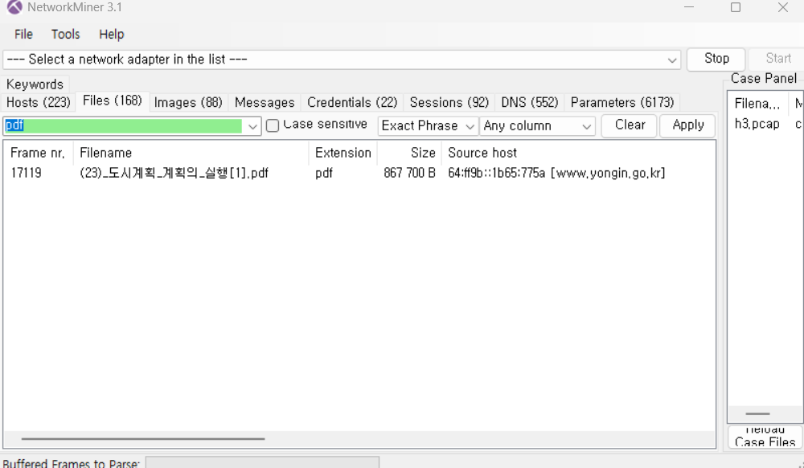
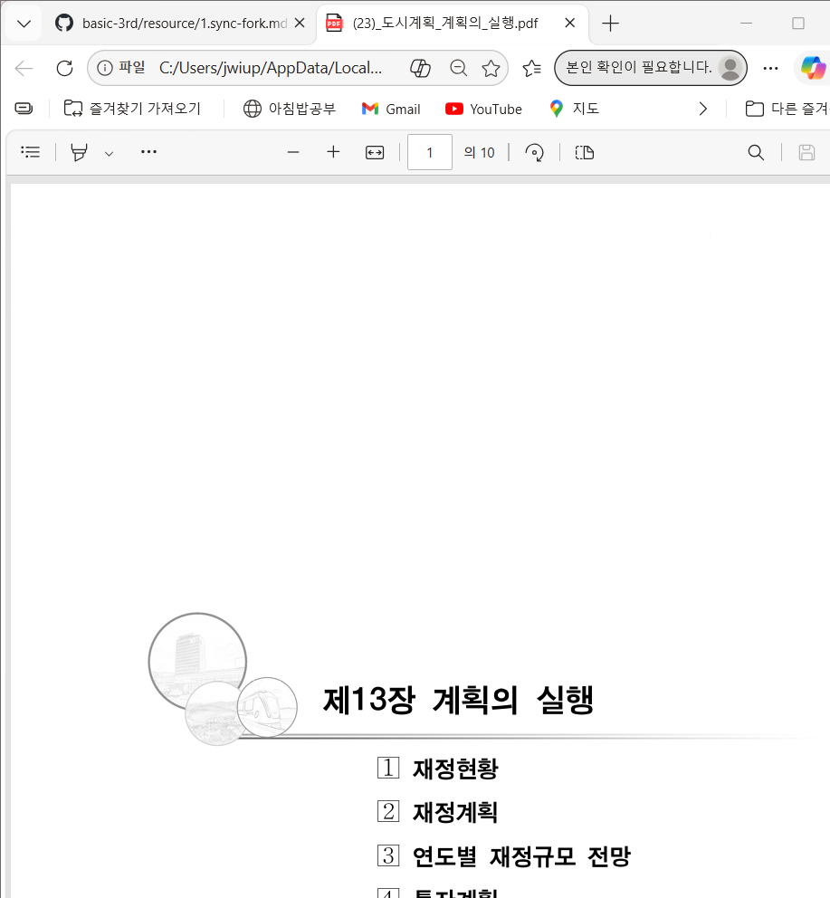

# 1. 기본 분석

- 사용된 프로토콜을 3가지 이상 작성하시오.
Ethernet
IPv6 (Internet Protocol Version 6)
TCP (Transmission Control Protocol)
UDP (User Datagram Protocol)
HTTP (Hypertext Transfer Protocol)
DNS (Domain Name System)
# 2. 웹 요청 분석

- HTTP 요청 중 ".pdf" 파일을 다운로드하는 요청을 찾으시오.

- 전체 URL (http:// 포함)을 작성하시오.
http://www.yongin.go.kr/ebook/src/viewer/download.php?host=main&site=20220430_101634_1&no=1
- 요청 방식(GET/POST)을 작성하시오.
GET
# 3. 서버 응답 분석

- 서버가 반환한 파일의 종류는 무엇인가?
application/pdf
- 파일 크기는 얼마인가?
867700 bytes (약 847KB)
- 파일 이름은 무엇인가?
(23)_도시계획_계획의_실행.pdf
# 4. 파일 복구

-  NetworkMiner를 사용하여 파일을 복구하고, 복구 과정을 단계별로 작성하시오.
NetworkMiner 실행
pcapng 파일 열기 (File → Open)
자동으로 패킷 분석 수행됨
상단 메뉴에서 Files 탭 클릭
목록에서 .pdf 파일 확인
해당 파일 선택
우클릭 또는 자동 저장된 경로에서 파일 확인
복구된 파일을 로컬에서 열어 정상 여부 확인

-  복구 과정 화면을 캡처하여 첨부하시오.

